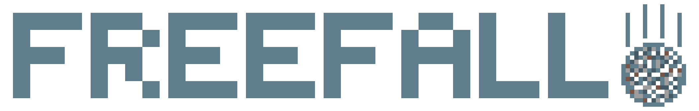

## GamePlay

FreeFall is a game in which you are a rock, which has unfortunately fallen from it's previous resting place. 
The goal is to get as far as you can, with only 3 lives.
There may or may not be an ending. 

## Software / Hardware

FreeFall is written in the [Arduino](https://arduino.cc) variant of C++, and uses the [Arduino Mega 2560](https://store.arduino.cc/products/arduino-mega-2560-rev3) 
for its extra I/O pins and enlargened memory. 
I use the [LCDWIKI_GUI](https://github.com/lcdwiki/LCDWIKI_gui) core library and the [LCDWIKI_KBV](https://github.com/lcdwiki/LCDWIKI_kbv) hardware-specific library 
to write to the display. 
You can see how to make it yourself [here](/installation). 

## License

This License can be modified at any time with no warning. once the license has been changed, Any Entity in Possesion of software copied, downloaded and/or reproduced from any version of the FreeFall software, including any version of software based on or copied from FreeFall any number of times mustmodify the license included with their software to be exactly the license contained here:

Terms:
    Any Entity in Possesion of software copied, downloaded and/or reproduced from any version of the FreeFall software, including any version of software based on  or copied from FreeFall any number of times must:
        1. Give credit to the following, included with the License available to anyone with data/internet, or available individually to anyone with data/internet:
            a. ShortsKing (John Peters)
            b. Anyone who modified the software before downloading
            and c. Whoever the software was received from, copied, downloaded and/or reproduced from any version of the FreeFall software, including any version of software based on or copied from FreeFall any number of times.
        
        2. Make sure that any Entity downloading or installing the software knows where the software is hosted aand that they can download it for FREE
        
        3. Include this license with the software, Unchanged, available to anyone with internet/data
        
Under these terms, anyone in possesion of the software can do whatever they like with it, EXCEPT sell anything with the software preinstalled, unless given direct fully written permission from ShortsKing, John Peters.
   
this license applies to all entities in possesion of the software EXCEPT for ShortsKing, John Peters. The terms of this license may be broken if given direct written permission from ShortsKing, John Peters.
